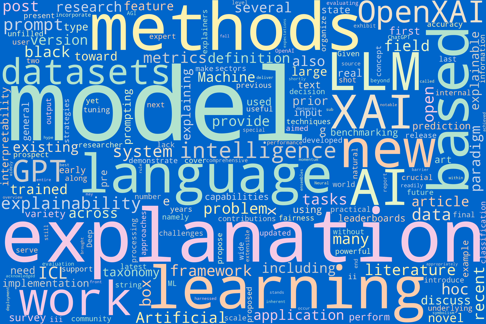
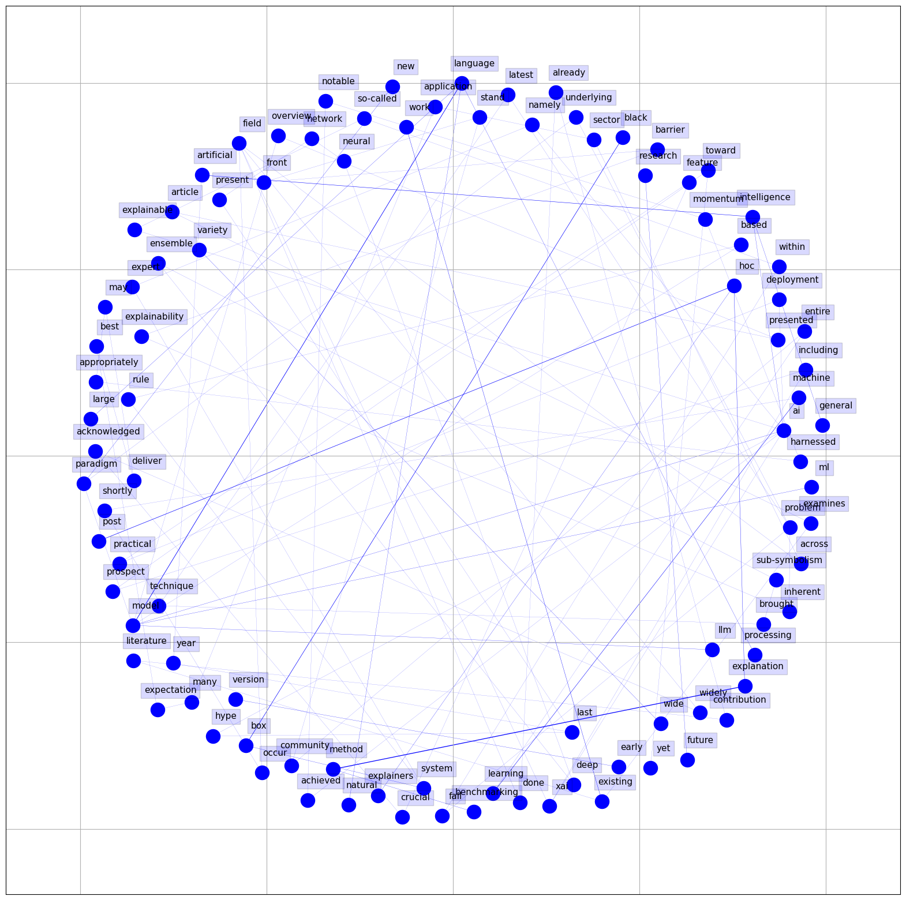
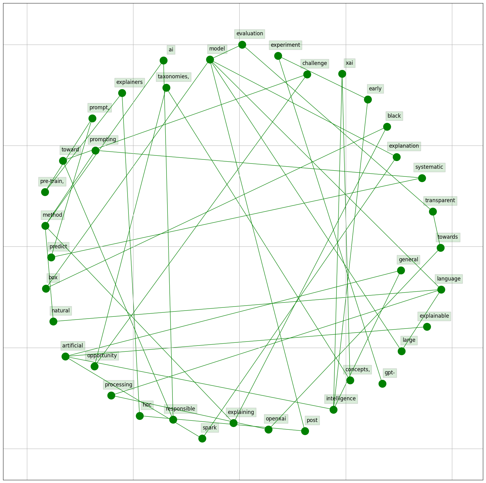

# Data Query Process Overview

The `code` directory contains scripts for executing Natural Language Processing (NLP) analysis on literature titles and abstracts relevant to our research. The process involves several key steps:

- **Word Cloud Generation:** We visualize the most frequent words from titles and abstracts using Word Clouds, highlighting the primary themes and concepts.
  
- **Text Cleaning:** Titles and abstracts undergo preprocessing to remove numbers, punctuation, and single characters. Additionally, URLs are removed to ensure clean text for analysis.

- **Tokenization and Normalization:** Text data is tokenized into words, and each token is then stemmed and lemmatized to its base form, removing any inflections.

- **Stopword Removal:** Common stopwords are filtered out to focus on the more meaningful terms in the data.

- **Bigram Analysis:** We construct a dictionary of bigram counts from the cleaned text, identifying the most common pairs of words for a deeper context understanding.

- **Network Plot Creation:** A graph is created to represent the relationships between bigrams, revealing the interconnected nature of the terms within the literature.

## Visualizations

Below are some visualizations generated from the analysis:

### Word Clouds

#### Abstract Word Cloud

#### Title Word Cloud

### Bigrams

#### Abstract Bigrams

#### Title Bigrams

// Pseudo-Code for NLP for Data Literature Analysis

// Part 0: Set-up
Install required libraries: kaleido, igviz
Import libraries: pandas, numpy

# NLP for Data Literature Analysis Pseudo Code

## Part 0: Set-up
- Install required libraries: `kaleido`, `igviz`
- Import libraries: `pandas`, `numpy`
- Read CSV file from "https://raw.githubusercontent.com/.../data_literature.csv" into DataFrame `df`
- Display DataFrame `df`

## Part I: Word Cloud

### 1.1 Title Word Cloud
- Join all titles in DataFrame `df` into a single string `title`
- Download and import `stopwords` from `nltk`
- Define a list of stop words including additional specific words
- Create a WordCloud object for `title` with specified dimensions, colors, and stopwords
- Generate and display the word cloud image for `title`
- Repeat the process with different background color for the word cloud

### 1.2 Abstract Word Cloud
- Join all abstracts in DataFrame `df` into a single string `Abstract`
- Add `.` to the list of stop words
- Create a WordCloud object for `Abstract` with specified dimensions, colors, and stopwords
- Generate and display the word cloud image for `Abstract`
- Repeat the process with different background color for the word cloud

## Part II: Bigram Analysis

### 2.1 Title Bigram
- Display column names of DataFrame `df`
- Import required libraries and methods for text processing
- Convert `Title` column to lowercase and concatenate into a single string
- Apply regex and string manipulation to clean and prepare text for analysis
- Define functions to remove URLs, stem, and lemmatize tokens
- Process the text to remove URLs, apply encoding, and split into words
- Define and refine a list of stop words for title analysis
- Further process the words list: lemmatization, punctuation removal, and stop words filtering
- Count and sort bigrams in the processed titles
- Create a DataFrame for title bigrams and sort by counts
- Print the top bigrams in LaTeX and Markdown formats
- Export the title bigram data to a CSV file
- Visualize the bigram network using NetworkX and matplotlib
- Plot and show the network graph
- Use `igviz` library to create an interactive graph and export as HTML

### 2.2 Abstract Bigram
- Repeat the same process as above for the `Abstract` column of DataFrame `df`
- Process and analyze bigrams in the abstracts
- Print, export, and visualize the abstract bigram data similar to title bigrams
