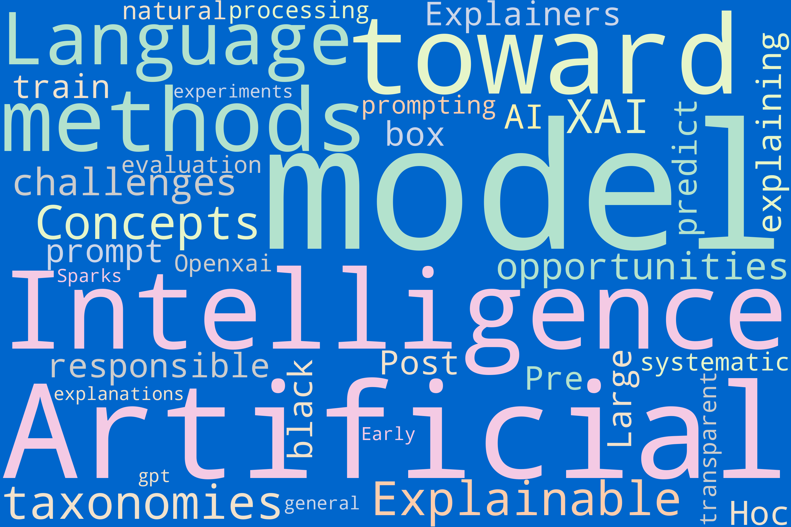

# Data Query Process Overview

The `code` directory contains scripts for executing Natural Language Processing (NLP) analysis on literature titles and abstracts relevant to our research. The process involves several key steps:

- **Word Cloud Generation:** We visualize the most frequent words from titles and abstracts using Word Clouds, highlighting the primary themes and concepts.
  
- **Text Cleaning:** Titles and abstracts undergo preprocessing to remove numbers, punctuation, and single characters. Additionally, URLs are removed to ensure clean text for analysis.

- **Tokenization and Normalization:** Text data is tokenized into words, and each token is then stemmed and lemmatized to its base form, removing any inflections.

- **Stopword Removal:** Common stopwords are filtered out to focus on the more meaningful terms in the data.

- **Bigram Analysis:** We construct a dictionary of bigram counts from the cleaned text, identifying the most common pairs of words for a deeper context understanding.

- **Network Plot Creation:** A graph is created to represent the relationships between bigrams, revealing the interconnected nature of the terms within the literature.

## Visualizations

Below are some visualizations generated from the analysis:

### Word Clouds

#### Abstract Word Cloud

#### Title Word Cloud

### Bigrams

#### Abstract Bigrams

#### Title Bigrams

